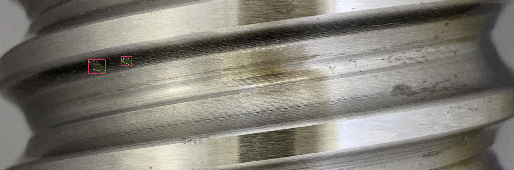
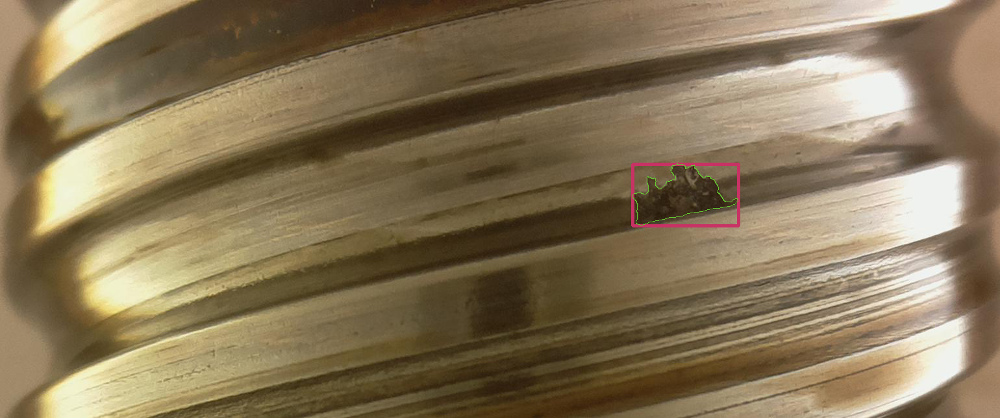
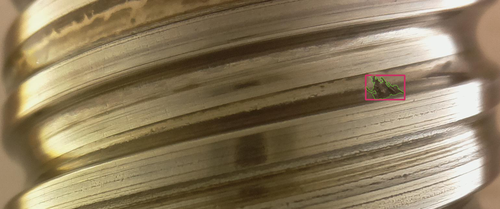

# Pitting localization and segmentation using RCNN
in this work, we try to detect and localize surface defects of type "pitting" on Ball Screw Drive dataset [[1]](#1). the dataset consists of 1104  RGB high resolution images of which 394 are annotated with pitting defects, the pitting size varries between very small pittings and large ones. also the dataset contain images with multiple pittings having different sizes.

  
  
  
  

# model and training
- first we transform the data to COCO format ( the function is availble in data.py file ) and split it to training and testing set using cocosplit library available at the following link https://github.com/akarazniewicz/cocosplit.git.
- second we construct our masked RCNN using pytorch, in our case we have 2 classes pitting and background (always present), the model construction is available int the - file model.py. the model behave differently during training and inference. during training the  model return the value of RCNN 5 losses, while during testing it returns the set of boxes with their calssification and scores along with the binary masks for segmentation.
- finally we train the model on 2 steps using dynamic waiting of the losses such that the model correctly detect and predict the bounding boxes with high confidence first then focuses on the segmentation task. so for the first step we have high waits for all the losses except the mask loss while in the second step all losses have approximately simillar waits.

# prediction visualizations

# Refrences
<a id="1">[1]</a>  Tobias Schlagenhauf, Magnus Landwehr, and Jürgen Fleischer: Industrial Machine Tool Component Surface Defect Dataset (2021). https://github.com/2Obe/BSData.git
