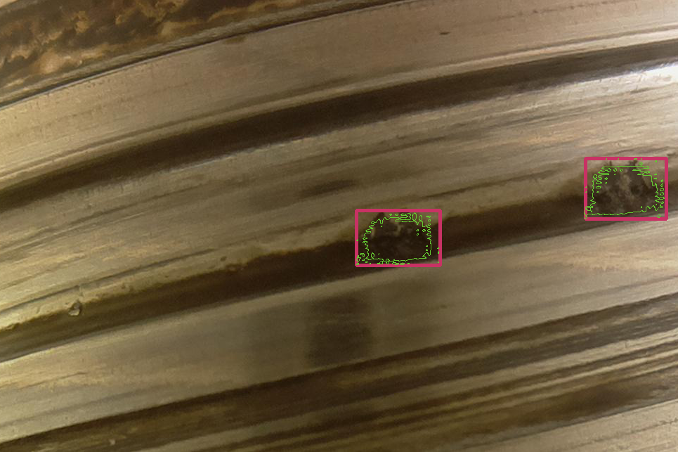
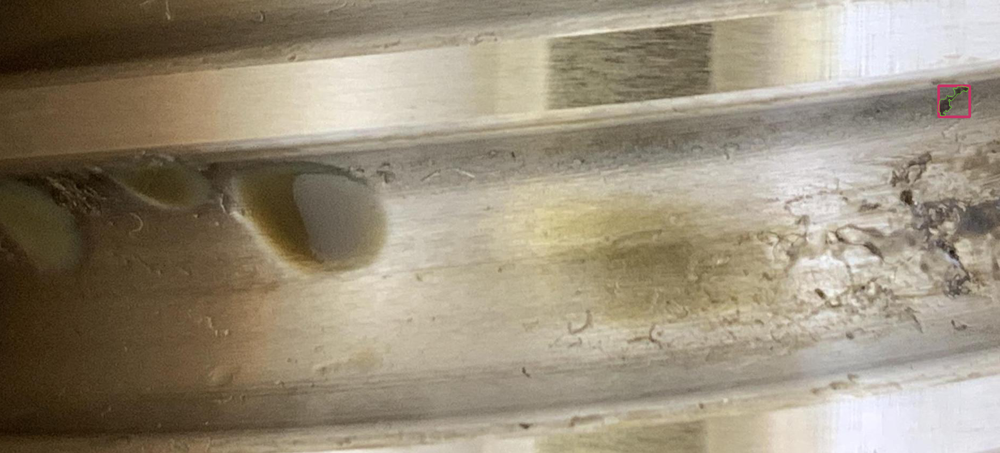

# Pitting localization and segmentation using RCNN
In this work, we try to detect and localize surface defects of type "pitting" on Ball Screw Drive dataset [[1]](#1). The dataset consists of 1104  RGB high resolution images of which 394 are annotated with pitting defects, the pitting size varries between very small pittings and large ones. also the dataset contain images with multiple pittings having different sizes.

  
  
  
  

# model and training
- First we transform the data to COCO format ( the function is availble in `data.py` file ) and split it to training and testing set using cocosplit library available at the following link https://github.com/akarazniewicz/cocosplit.git.
- For the second step we construct our masked RCNN using pytorch, in our case we have 2 classes pitting and background (always present), the model construction is available int the file `model.py`. The model behave differently during training and inference. During training the  model return the value of RCNN 5 losses, while during testing it returns the set of boxes with their calssification and scores along with the binary masks for segmentation.
- Finally we train the model in 2 steps using dynamic wheighting of the losses such that the model correctly detect and predict the bounding boxes with high confidence first then focuses on the segmentation task. So for the first step we have high wheights for all the losses except the mask loss while in the second step all losses have approximately simillar wheights.

# post processing 
since the model return a set of boxes with different scores usually most of them overlaps. So we implement a post processing technique that calculate the intersecton area of 2 predicted boxes over the area of the smallest box between them ( only if the prediction is for the same class) then check if this fraction is bigger than a specific threshold to decide weither to keep or remove the box with the lower score between them.  
A second post processing technique that only keep boxes with confidence score greater than a threshold was also implemented to limit the number of false positives.
those post processing methods are  implemented in `visualize.py`
# prediction visualizations
<h3 align="center">real vs prediction</h3>

  
  
  
  
  
  

# MAP scores
since the resources used for this work were limited the model was trained with batch size=2 and for 10-20 epochs , the model is not able to recognize small objects 
below are some MAP scores
  |map|0.46|
  |map_40||
  |map_small||
  |map_large||
# References
<a id="1">[1]</a>  Tobias Schlagenhauf, Magnus Landwehr, and Jürgen Fleischer: Industrial Machine Tool Component Surface Defect Dataset (2021). https://github.com/2Obe/BSData.git
